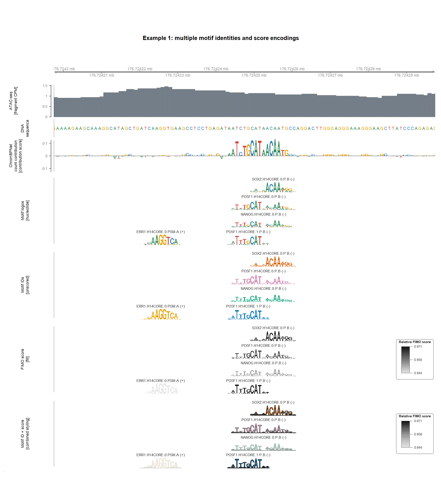
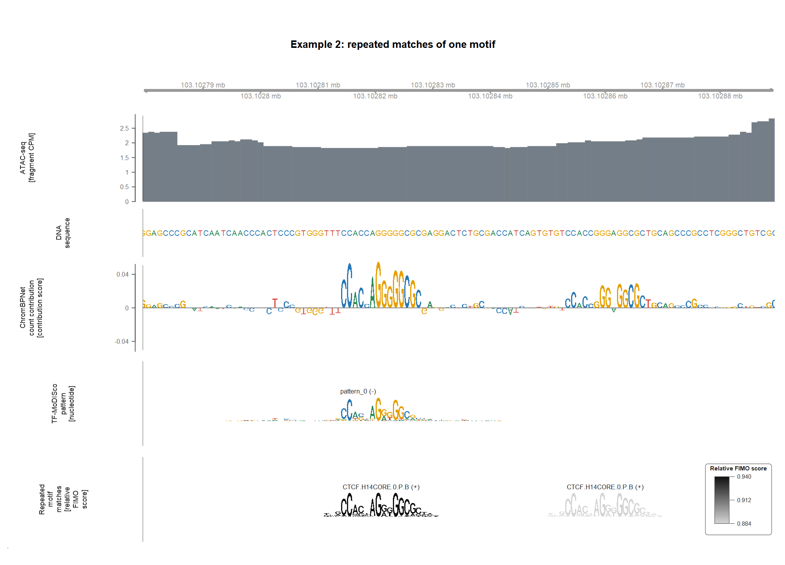

# GvizRegulatoryTracks

`GvizRegulatoryTracks` adds two custom genomic tracks to
[Gviz](https://bioconductor.org/packages/Gviz):

- `ScoreSequenceTrack()` scales every nucleotide by a signed score, for
  example a ChromBPNet contribution score.
- `MotifLogoTrack()` places sequence logos directly at genomic motif matches.

Both return normal `Gviz::CustomTrack` objects. They can be combined with
`DataTrack`, `AnnotationTrack`, `GeneRegionTrack`, and the other Gviz tracks.

## Examples






## What It Does
### Score Sequence Tracks
- Draws positive and negative nucleotide scores above and below zero.
- Retrieves reference sequence from FASTA, BSgenome, 2bit, DNAStringSet, or an
  existing Gviz `SequenceTrack`.
- Switches from nucleotide letters to a normal resolution-aware Gviz signal
  track when zoomed out.
### Motif Logo Tracks
- Reads motif matches from BED or `GRanges` and motifs from MEME files,
  matrices, or `universalmotif` objects.
- Reverse-complements minus-strand motif-matches into reference-genome orientation.
- Colors motifs by nucleotide, motif ID, score, or a combination of motif ID
  and score.
- Switches from logos to genomic ranges when the view becomes too wide.

## Installation

```r
remotes::install_github("jjfroehlich/GvizRegulatoryTracks")
```

## Basic Usage

```r
library(Gviz)
library(GvizRegulatoryTracks)
library(GenomicRanges)

region <- GRanges("chr1", IRanges(100001, 100250))

score_track <- DynSeqTrack(
    scores = "counts_scores.bw",
    region = region,
    reference = "mm10.fa",
    genome = "mm10",
    name = "Contribution\n[score]"
)

motif_track <- MotifLogoTrack(
    hits = "fimo_hits.bed",
    motifs = "motifs.meme",
    name = "Motifs"
)

plotTracks(
    list(score_track, motif_track),
    chromosome = "chr1", from = 100001, to = 100250,
    sizes = c(1.3, 1),
    background.title = "transparent",
    col.border.title = "transparent"
)
```

`DynSeqTrack()` is an alias name for `ScoreSequenceTrack()`.

## Inputs

| Track | Main input | Sequence or motif input |
|---|---|---|
| Score sequence | Numeric vector | DNA string |
| Score sequence | Scored `GRanges` | DNA or a reference source |
| Score sequence | BigWig or bedGraph | DNA or a reference source |
| Motif logo | BED or `GRanges` | MEME, matrices, or `universalmotif` |

A BigWig only contains scores. Supply `reference` when you also want letters.
Without sequence, `ScoreSequenceTrack()` still works as a signal track. 
Same constructor works for any base-resolution genomic score, such as attribution/contribution or phyloP conservation. 

For very large BigWigs, an alternative reader can be supplied through
`importFunction(file, selection)`. The function should return a scored
`GRanges`.

## Score Sequence Tracks

At close zoom, letters are scaled by their signed value. At wider views, drawing is
delegated to a real `Gviz::DataTrack`, including Gviz window aggregation.

The y axis is also handled by Gviz. Options such as `showAxis`, `ylim`,
`yTicksAt`, `col.axis`, and `cex.axis` work like they do for a `DataTrack`.
Use `scoreYlim()` when several tracks should share one symmetric scale.
The left data boundary is drawn by default; use `showBoundary`,
`boundaryColor`, `boundaryWidth`, and `boundaryInset` to change it. The inset
keeps adjacent track markers visually separate.

## Motif Logo Tracks

The BED `name` column should contain the motif ID and match a motif name
in the MEME file. The imported hit width must match the PWM width.

Use the standard nucleotide colors:

```r
nucleotide_logo <- MotifLogoTrack(
    hits, "motifs.meme",
    motifColorBy = "nucleotide",
    scoreAesthetic = "none"
)
```

Color several motif IDs consistently:

```r
motif_id_logo <- MotifLogoTrack(
    hits, "motifs.meme",
    motifColorBy = "motif_id",
    motifPalette = c(M1 = "#0072B2", M2 = "#D55E00")
)
```

Or map a numeric hit column, such as relative FIMO score, to motif appearance:

```r
score_logo <- MotifLogoTrack(
    hits, "motifs.meme",
    scoreColumn = "relative_fimo_score",
    scoreAesthetic = "fill",
    scoreLimits = "view",
    scoreColor = "#111111",
    scoreLegendTitle = "Relative FIMO score"
)
```

`scoreAesthetic` supports `fill`, `brightness`, `opacity`, and `border`. Motif
ID can control fill while a score controls brightness, opacity, or border. Set
`showScoreLegend = FALSE` when no legend is wanted.

Logos have a fixed maximum physical height, controlled by `motifHeight` in mm.
Use `sizes` in `plotTracks()` to give tracks with many overlapping lanes more
room. If the track is too short, logos and labels shrink together instead of
stretching or overlapping.

Minus-strand hits are reverse-complemented by default. Set `showStrand = TRUE`
to add strand labels. `reverseStrand = TRUE` in `plotTracks()` is handled too.

## Coordinate Conventions

- In-memory coordinates and `region` are one-based and closed.
- BED and bedGraph are zero-based and half-open on disk. `rtracklayer` converts
  them to one-based `GRanges` during import.
- BigWig regions are selected with one-based `GRanges`; `rtracklayer` handles
  the on-disk convention.
- Motif hit width must equal PWM width after import.

For example, BED `chr1 9 12` imports as `chr1:10-12`, with width three.

## Development

Run the tests:

```r
devtools::test()
```

Run the package check:

```r
devtools::check()
```

## Support

Please [open an issue](https://github.com/jjfroehlich/GvizRegulatoryTracks/issues)
if you find a problematic genomic input or want to contribute another track
style.
